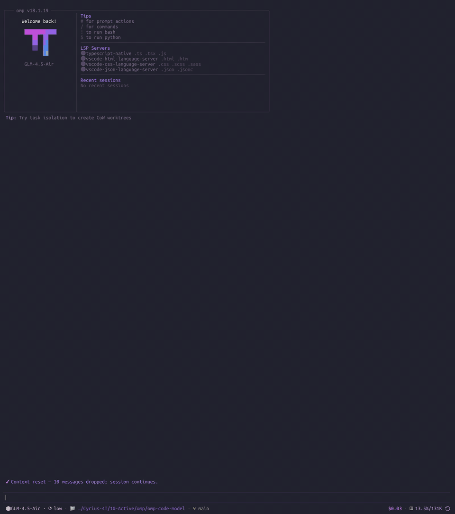

# OMP Code Model

`omp-code-model` adds same-conversation coding phases to [OMP](https://github.com/can1357/oh-my-pi). The main model defines requirements and interfaces, hands implementation to a configured coding model, and returns for final review with the full history and tool state intact.

> [!IMPORTANT]
> **Jev-powered automatic routing is now built in.** Run `/code-model routing` to open a graphical selector for `off`, `observe` or `enforce` mode and the `main_agent` or `code_model` fallback. In `enforce` mode, Jev can route implementation into the configured coding model, then the original model returns for review in the same conversation.



[Watch the complete accelerated MP4 recording](demo/code-model-demo.mp4).

## Flow

```text
main model
  → code-model start
  → configured coding model and effort
  → implementation and targeted checks
  → code-model finish
  → original model review
```

## Recorded cost example

The current demo records one complete task launched with `omp`. GPT-6-Astra plans the work, Gemini 3.8 Flash implements it in the coding phase, and GPT-6-Astra returns to inspect the diff and correct three issues.

| Model and role | Input | Output | Cache read | Recorded cost |
| --- | ---: | ---: | ---: | ---: |
| GPT-6-Astra · planning and final review | 136,367 | 12,085 | 1,627,136 | $3.595056 |
| Gemini 3.8 Flash · coding phase | 360,267 | 42,471 | 4,200,137 | $0.744477 |
| **Complete conversation** | **496,634** | **54,556** | **5,827,273** | **$4.339533** |

Applying GPT-6-Astra's listed rates to every observed token produces a price-normalised estimate of **$13.521413**. The recorded model split is **$9.181880 lower**, a **67.9% reduction** for the complete conversation. The coding phase alone costs 92.5% less at the recorded Gemini rates. This comparison holds token counts constant; an all-GPT run can follow a different execution path and produce a different token count.

The recording and its machine-readable usage data remain in `demo/session-cost.json`.

The extension provides:

- an essential `code-model` tool with `recommend`, `start`, `finish` and `status` actions;
- optional TypeSafe Jev routing across the current main model, the configured coding model and an explicitly authorised subagent;
- opt-in `before_agent_start` routing modes: `off`, `observe` and `enforce`;
- quota-aware recommendations sourced from `omp usage`, with configurable `main_agent` or `code_model` fallback;
- graphical `/code-model` settings for Provider → Model → Effort → Save and a `/code-model routing` selector for mode and fallback;
- persistent phase, recommendation and automatic-routing audit state in the session tree;
- restoration after completion, cancellation, retry fallback, session navigation and shutdown;
- English and Simplified Chinese menus selected from the current locale.

## Install

Install directly from GitHub:

```sh
omp plugin install github:cyriusweng/omp-code-model
```

Restart OMP after installation. Local development can use a link:

```sh
git clone https://github.com/cyriusweng/omp-code-model.git
omp plugin link ./omp-code-model
```

OMP 18.2.0 is the compatibility target.

## Configure

Open the graphical selectors:

```text
/code-model
/code-model routing
```

The first menu presents providers and models from the active OMP catalogue. The routing menu configures Jev preflight behaviour and fallback. Both selections are stored at:

```text
~/.omp/agent/code-model.json
```

`PI_CODING_AGENT_DIR` changes the active agent directory. `OMP_CODE_MODEL_CONFIG` can name a dedicated configuration file.

Useful commands:

```text
/code-model show
/code-model models
/code-model recommend implement the requested change and run targeted tests
/code-model routing
/code-model routing observe main_agent
/code-model routing enforce main_agent
/code-model routing off
/code-model status
/code-model start
/code-model finish
```

The main model usually calls the `code-model` tool itself. `recommend` is advisory and sends its task summary plus sanitised model and quota facts to TypeSafe when `/login typesafe` or `TYPESAFE_API_KEY` provides a credential. Its result identifies the judgment backend, confidence, quota state and fallback reason. `start` is a standalone tool call before implementation; its optional `effort` applies the recommendation for that coding phase, while omission uses the saved profile. `finish` is a standalone tool call after targeted checks. The active OMP approval policy continues to govern tool use.

Automatic routing defaults to `off`. `observe` asks Jev before every user-containing prompt and records a receipt while preserving the current model. `enforce` applies eligible routing recommendations whose finite confidence meets `routing.minConfidence`, which defaults to `0.5` and accepts values from `0` to `1` in the configuration file. This threshold applies to both `code_model` and `main_agent` recommendations. Low-confidence or missing-confidence recommendations preserve the actual active phase. Interactive routing changes preserve a saved custom threshold.

The configured fallback runs when the TypeSafe credential or request is unavailable. `main_agent` retains or restores the main phase according to phase ownership; `code_model` enters the configured coding phase when its model and quota remain eligible. This explicit fallback policy operates independently of the TypeSafe confidence threshold. Receipts record the requested route, effective route, confidence, threshold and decision reason. Automatically owned phases follow the existing completion and retry lifecycle, while manually started phases retain their explicit ownership.

## Reliability behaviour

The extension records the original model and configured effort before entering a coding phase. A model or effort selected through another OMP control remains active when the phase ends. Retry fallback entries remain phase-owned so a repeated `start` keeps the original restoration target.

An interrupted switch stores a recoverable phase marker. Session lifecycle events restore recorded state, navigation waits for restoration, and the configuration writer uses an atomic rename with concurrent-update detection.

## Development

Requires Node.js 22 or later.

```sh
npm test
npm run check
```

The test suite covers configuration integrity, interactive menu flows, manual and automatic Jev routing, prompt-hook idempotency, fallback behavior, phase transitions, recovery, retry fallback, configured `auto`, extension registration and lifecycle completion.

## Licence

MIT
